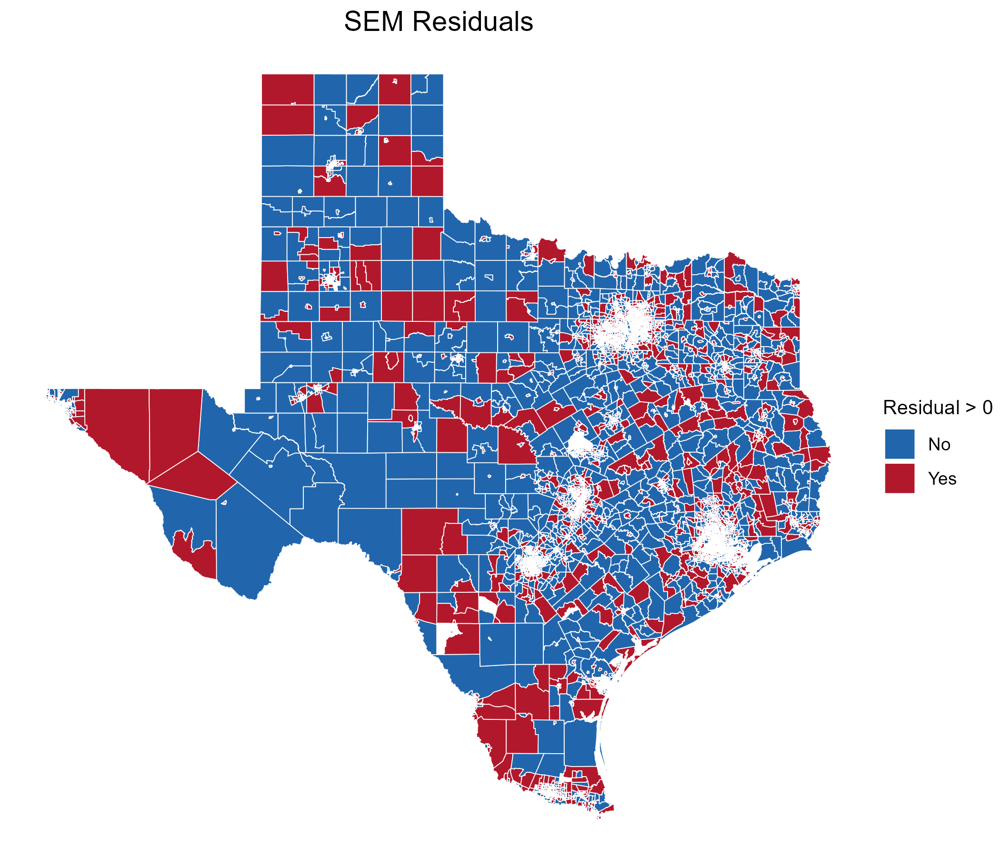

---
output:
  pdf_document: default
  html_document: default
---
# Project Written Sections

#Introduction

# Background 
```{r}
library(knitr)
```

## Defining Food Insecurity

	Food insecurity refers to the lack of reliable access to sufficient, nutritious food which encompasses four dimensions: availability, access, stability and utilization (Uppal, 2023). Insecure household may face difficulties in acquiring food, affording nutritious meals or maintain stable access due to infrastructure or economic disruption. According to the USDA, food insecurity can range from limited dietary variety and quality to severe disruptions like insufficient food intake (Coleman-Jensen et al., 2019). Beyond nutritional concerns, it is closely linked to a higher likelihood of chronic illnesses, mental health issues, frequent hospital visits and even mortality (Uppal, 2023). In 2018, around 11.1% of households in the United States, over 14 million, struggle with food insecurity, including 4.3% that experienced very low food security (Coleman-Jensen et al., 2019). On a global scale, rates of food insecurity have been increasing, driven by factors like inflation, economic uncertainty, and systemic inequalities. While these national statistics are alarming, Texas often exceeds national averages, particularly in marginalized and rural areas. In 2020-2022, 15.5% of households were food insecure, exceeding the national average of 12.8% (USDA ERS, 2023). Therefore, highlighting its urgency as a case study for deeper spatial and racial food access disparities (Dean & Sharkey, 20100; Janda et al., 2022). The complex and multifaceted nature of food insecurity calls for both large-scale policy reforms and locally tailored, community-driven strategies.
	
## Structural Causes of Food Insecurity

Food insecurity is associated with various structural inequalities, including income disparities, access to capital, and systemic barriers rooted in racism. Several studies revealed that food insecurity is the result of compounding factors that disproportionately affect racialized communities in the United States.
 In a systematic review of studies on food deserts by Beaulac et al. (2009), they concluded that socioeconomic deprivation at the community level intensifies individual-level disparities in the United States. Their review concluded that low-income neighbourhoods that were predominantly African American continuously had fewer supermarkets while experiencing limited geographic access to affordable, healthy food (Beaulac et al., 2009). This structural disadvantage hinders an entire community’s access to nutritious foods, especially in areas dominated by convenience stores that typically offer unhealthy and expensive food items. 
 
  Similarly, Myers and Painter (2017) examined the relationship between race/ethnicity, nativity and food insecurity. They found that Black and Latino households in the United States suffer more than twice as much from food insecurity in comparison to white households, even when accounting for socioeconomic status (Myers & Painter, 2017). Given that minority neighbourhoods have fewer quality supermarkets regardless of socioeconomic status, the authors suggest this gap stems from spatial inequalities. These spatial inequalities indicate that race, independent of income, shapes access to nutritious food. 
Nam et al. (2015) confirm these findings in their analysis of racial disparities in food insufficiency. In their study, the authors found that Black, Hispanic, and American Indian families experience food insecurity at a statistically significantly higher rate than White families (Nam et al., 2015). When the authors conducted a breakdown of contributing factors, they discovered that this disparity among the minority groups was tied mainly to lower homeownership rates, access to credit, and insufficient financial assets (Nam et al., 2015). These economic disparities increase susceptibility during times of financial hardship, restricting minority families’ ability to protect themselves from food insecurity. 
Collectively, the research conducted emphasizes that the intersection of race and socioeconomic class creates compounded disadvantages for families of non-White backgrounds. Furthermore, this suggests that food insecurity in the United States, particularly in Texas, is not solely tied to income but several other systemic barriers that are shaped by racial inequality. 

## Race, Place, and Access

T exas food insecurity is deeply shaped by spatial and racial inequalities in food access. In rural Central Texas, residents often face limited access to supermarkets and healthy food outlets, typically traveling long distances for groceries and relying on nearby convenience stores with fewer nutritious options. This geographic isolation, coupled with underdeveloped infrastructure and lack of public transportation, contributes to higher food prices and limited dietary quality compared to urban areas (Dean & Sharkey, n.d.; Dean & Sharkey, 2011). Janda et al. (2022) further support these findings, examining food insecurities across different geographic contexts in Travis County. They found that individuals living in rural zip codes were more than twice as likely to experience food insecurities compared to those in urban areas. This remains significant even after controlling for factors like income, educational level, employment status and access to transportation (Janda et al., 2022). Additionally, Janda’s 2020 dissertation research documented rural and peri-urban callers to the 2-1-1 helpline in Central Texas. The finding shows that these areas were significantly more likely to seek help with food assistance. This was true for individuals living in zip codes that lacked supermarkets, emphasizing the role that geographic proximity plays in shaping spatial disparities in food access.

  Race and geography shape disparities in food insecurity across Texas. The Supplemental Nutrition Assistance Program (SNAP), formerly known as food stamps, was established to combat food insecurity among low-income populations providing assistance to purchase food.Yet disparities persist even among SNAP-eligible households. Samuel et al. (2023) found that across the United States, SNAP-eligible Black and multiracial households experience higher rates of food insecurities compared to White counterparts. This disparity was especially evident among those who were not enrolled in the program. Among households not participating in SNAP, those that identify entirely Black were 52% more likely to experience food insecurity compared to White households. Similarly, multiracial households faced a 42% higher risk of food insecurity than their White counterparts. Importantly, among households actively participating in SNAP, the racial disparities in food insecurity were no longer observed. This suggests that while food assistance programs can help reduce the effects of structural inequalities, it does not entirely eliminate them (Samuel et al., 2023). In Central Texas, Janda et al. (2022) reported that Hispanic participants had 2.79 times greater odds of being food insecure than participants who were non-Hispanic white. This aligns with the broader finding identifying that race/ethnicity often intersect with income in shaping food insecurity risk (Janda et al., 2022). Janda and others highlight that communities of color are disproportionately affected by systemic barriers such as reduced access to full-service grocery stores and overreliance on small retailers with fewer healthy options (Beaulac et al., 2009; Walker et al., 2010; Janda et al., 2022).

  Rural Texans face unique and persistent barriers to food security, often shaped by limited infrastructure, social isolation and inadequate food retail presence. Dean and Sharkey (2011) emphasized that rural areas not only lack supermarkets, but exhibit weaker social networks and less communal support. These factors further undermine resilience against food insecurity. Janda et al. (2022) extends on this understanding by showing that rural residents in Central Texas often live farther from supermarkets, an average of 1.66 miles but closer to convenience stores with an average of 0.67 miles. This proximity gap disproportionately affects low-income and Hispanic households, exacerbating nutritional disparities and increasing vulnerability to food insecurity (Janda et al., 2022). 

  Moreover, the uneven distribution of food retailers and limited transportation options in rural areas indicate that effective solutions must be customized to local needs and the resident’s lived experiences. Janda et al. (2022), emphasize the importance of incorporating factors such as perceived accessibility, community preferences and cultural appropriateness. These factors are often overlooked in conventional approaches to identify food deserts. 

## Policy Landscape and Limitations

  SNAP (formerly known as food stamps) is the largest federal food assistance initiative in the United States. It is designed to alleviate food insecurity by providing financial support for low-income families. While SNAP reduces food insecurity by helping millions of families each year, its effectiveness is still limited by structural and environmental factors. 
Grummon and Taillie (2018) found that even with SNAP participation, there are still racial disparities in purchasing patterns. Their findings show that Black SNAP participants tended to purchase more processed meats, sweeteners, and low-nutrient foods compared to White participants of the program (Grummon & Taillie, 2018). Notably, these disparities do not appear in non-participating families. This suggests that the SNAP program, although it may aid in access to food, does not enhance diet quality equally among different racial/ethnic groups (Grummon & Taillie, 2018). 

  Odoms-Young (2018) highlights how these disparities are influenced by structural racism in food systems and public policy. Factors such as housing segregation, financial inequality, and high incarceration rates disproportionately impact communities of colour (Odoms-Young, 2018). These factors create barriers to food assistance and healthy food options. The author also notes that these racial disparities exist even when socioeconomic factors are removed (Odoms-Young, 2018), highlighting once again that race independently impacts access to nutritious foods. 

  A study of a low-income Latino neighbourhood in Upstate New York by Lopez-Class and Hosler (2010) revealed that most local stores that accepted SNAP still provided limited access to nutritious items and high food prices. For example, only one store in the entire neighbourhood carried high-fiber bread compared to seven in the adjacent non-Latino neighbourhood (Lopez-Class & Hosler, 2010). On top of this, many of the stores were not disability-accessible and public transport to these locations was insufficient (Lopez-Class & Hosler, 2010). Consequently, residents without cars were often forced to rely on smaller retailers with higher prices and fewer nutritional options, which erodes the intended support of SNAP assistance (Lopez-Class & Hosler, 2010). 

  In conclusion, while SNAP has been critical for tackling food insecurity, its current system fails to address the disparities in purchasing patterns of minority groups and the system issues that lead to these racial and geographic disparities. Effective policy reforms are required to consider inequitable food access caused by transportation limitations, and racial and place-based disparities that constrain how SNAP assistance is used. 

## Gaps in the Literature

  Despite substantial research on food insecurity in the United States, particularly in Texas, a significant gap remains. The gaps are seen in studies that integrate both spatial and racial/ethnic dimensions using spatially explicit methods. Most of the existing studies focus on racial disparities (e.g. food insecurity among Black, Latino and immigrant community) or spatial disparities (e.g. rural-urban food deserts) but rarely examine how race, place and poverty interact at a localized scale (Beaulac et al., 2009; Myers & Painter, 2017). Myers and Painter (2017) found persistent food insecurity divide across racial/ethnic and nativity lines, even after controlling for socioeconomic status. On the other hand, spatial studies like Janda et al. (2022) and Lopez-Class & Hosler (2010) underscore geographic barriers like proximity to supermarkets but does not consistently take into account for racialized experiences of those affected. Furthermore, studies examining the impact on SNAP on reducing disparities have primary used cross-sectional or nationwide datasets. This often fails to capture how SNAP participation intersect with race and geographical context at a local level (Grummon & Taillie, 2018). This leaves an analytical blind spot regarding localized, intersectional factors of food insecurity in Texas. This project hopefully contributed to closing this gap by using inferential and spatial statistical methods to examine how race, income, location and SNAP usage interact, offering a greater understanding of food access inequalities in Texas.

# Study Area

# Methods 

## Methods for Spatial Statistics 
County-level data on food stamp usage and race in Texas were analyzed using the df_race.rds shapefile. This shapefile included variables such as the percentage of residents receiving food stamps and racial composition. It was imported into R and reprojected using st_transform() to EPSG:3857 to ensure accurate distance-based and spatial relationship calculations.

	To visualize the geographic distribution of food stamp usage, an initial choropleth map was created using ggplot() and geom_sf(), with the variable food_stamp_p representing the percentage of food stamp recipients in each county. The scale_fill_viridis_c() was used to apply a colour gradient that improves interpretability for viewers by emphasizing variation in values. Prior to analysis, counties with missing values were excluded using filter(!is.na(food_stamp_p)) to prevent skewed results and ensure clean spatial computations.
	
To analyze local spatial interactions, a neighbourhood structure was established using Queen contiguity through the poly2nb() function, which identifies counties as neighbours if they share a boundary or a corner point. This structure was then transformed into a spatial weights matrix using nb2listw(), allowing the influence of neighbouring counties to be incorporated into subsequent spatial analyses.

Spatial moving averages (SMAs) were computed using lag.listw() for key variables such as food stamp usage (sma_food_stamp_p) and racial proportions (e.g., sma_white_p, sma_black_p, sma_asian_p, sma_american_indian_p, sma_pacific_islander_p, sma_other_p). SMAs provide a smoothed view of regional patterns by averaging the values of surrounding counties instead of the raw data. This approach emphasizes clusters of consistent low or high values, making the broader spatial trend easy to identify. 

A null simulation envelope was generated to assess whether observed spatial patterns were stronger than would be expected under random distribution. It involved randomizing the food stamp usage values using a sample (food_stamp_p) and recalculating the SMA of the randomized data. Therefore, it created a baseline scenario representing spatial randomness, allowing for visual and statistical comparison with the actual SMA pattern. The difference between the observed and randomized results offers insight into the presence and strength of spatial autocorrelation within the data. 

	The local Gi* statistic (Local G) was computed using localG() from the spdep package to identify areas of statistically significant clustering. This technique evaluates each county’s value relative to the average of its neighbouring counties and generates a Z-score. This Z-score determines whether it belongs to a statistically significant high-value cluster (hotspot) or a low-value cluster (coldspot). The analysis was applied to food stamp usage and racial proportion to explore the spatial overlap between race and food insecurity. The resulting Gi* values were incorporated using mutate() and converted to numeric format using as.numeric() to enable plotting. Since localG() outputs a specialized object class, converting the results to numeric format was required to ensure compatibility with ggplot() for mapping and visualization.
	
	Lastly, maps were generated to visualize the Gi* Z-scores using ggplot() and scale_fill_gradient2(), with a midpoint of zero. Red tones indicated statistically significant hotspots (high-value clusters), blue/green tones indicated coldspots (low-value clusters), and yellow areas represented neutral or non-significant regions. This mapping approach successfully highlighted clusters of food insecurity and racial distribution, offering a spatial perspective for understanding systemic disparities among the counties in Texas. 

##Methods for Regression Analyses 
Regression models were estimated using tract-level data on per-capita food stamp usage, racial composition, and several control variables, including unemployment rate, median household income, and per-capita households with children.

Initial analyses employed methods of Ordinary Least Squares (OLS) regression to examine the relationship between food stamp usage and racial composition, controlling for socioeconomic factors. To resolve the challenge of perfect multicollinearity, the White racial category was omitted as the reference group. Both linear and log-transformed models were tested to explore differences in functional form. However, a Moran’s I test using the moran.test() function revealed significant spatial dependence, prompting further investigation.

To address spatial autocorrelation in the OLS residuals, a spatial weights matrix was constructed using a k-nearest neighbors approach. Tract centroids were calculated using st_centroid(), and neighborhoods were defined with k=4 using knearneigh(). The final spatial weights matrix was constructed using nb2listw().

A geographically weighted regression (GWR) model with Gaussian weighting was then estimated using gwr.sel() and gwr() to produce localized estimates. However, residuals from the GWR model remained spatially autocorrelated, as indicated by a Moran’s I test.

To explicitly account for residual spatial dependence, a Spatial Error Model (SEM) was estimated. This method accounts for spatial autocorrelation by incorporating a function of the spatially dependent residuals within the error term. A Moran’s I test confirmed spatial independence of the SEM residuals, indicating the validity of the estimates. 


```{r include_txt, echo=FALSE, results='asis'}
cat(readLines("morans_summary.txt"), sep = "\n")
```

##Regression Analyses 

The Spatial Error Model (SEM) reveals statistically significant relationships between food stamp usage and racial composition across Texas census tracts. Because the per capita proportions for all race groups must sum to 1.00, the White race category was excluded from the regression to avoid multicollinearity. Therefore, “White” serves as the reference group. 


Holding all other variables constant, a one percent increase in the share of Black residents corresponds to a 0.057% rise in per capita food stamp usage (p < 0.0001), while a one percent increase in the “other” category yields a 0.037% increase (p < 0.0001). In contrast, a one percent uptick in the Asian share leads to a 0.018% decrease in food stamp usage (p ≈ 0.007). The American Indian and Pacific Islander coefficients are not statistically significant at the 10% level (p = 0.603 and p = 0.198, respectively). 


Among the control variables, every additional $10,000 in median household income predicts about a 0.006% decrease in per capita food stamp usage (p < 0.0001). On the other hand, higher values in per-capita households with children and unemployment rate increase reliance on food stamps by 0.197% and 0.133% respectively (both p < 0.0001).
The SEM’s spatial error coefficient is λ = 0.53 (p < 0.001), indicating substantial spatial clustering in the regression errors. This high lambda value justifies our use of the SEM specification. Indeed, the SEM outperforms OLS with a much lower AIC (–26,092 vs. –24,818). To confirm that we’ve successfully removed residual spatial autocorrelation, we ran a Moran’s I test on the SEM residuals. The result of Moran’s I = –0.0396 (p < 0.0001) reveals a slight negative autocorrelation that is highly significant. This demonstrates that the SEM specification has absorbed spatial dependence in the residuals, thus validating the reliability of our regression coefficients. 


Together, these results reveal a strong relationship between race and food stamp usage across Texas census tracts. Relative to the White population (which serves as the reference group), areas with a higher proportion of Black residents show the largest increase in food stamp usage. Therefore, communities with a high percentage of Black residents experience a disproportionately larger reliance on SNAP compared to any other race group. Similarly, tracts with a greater share of residents classified in the "other" racial category also show higher food stamp usage than White census tracts, though this relationship is slightly weaker than it is for Black communities. In contrast, tracts with a greater proportion of Asian residents actually show lower food stamp usage compared to White tracts. The coefficients for American Indian and Pacific Islander groups are not statistically significant, and so these coefficients are not directly interpretable. Additionally, the control variables follow expected patterns. A higher median household income is associated with lower food stamp use, while greater unemployment and a greater share of households with children correspond with increased food stamp usage. 


```{r, results='asis', echo = FALSE}
cat(readLines("morans_i_test_output.txt"), sep = "\n")
```




# References

<!-- Hanging indent block -->
<div style="margin-left: 0.5in; text-indent: -0.5in; line-height: 1.5;">

Beaulac, J., Kristjansson, E., & Cummins, S. (2009). A systematic review of food deserts, 1966–2007. *Prevention of Chronic Disease, 6*, A105. https://resolver-scholarsportal-info.libaccess.lib.mcmaster.ca/resolve/15451151/v06i0003/nfp_asrofd1.xml  
<br><br>
Coleman-Jensen, A., Rabbitt, M. P., Gregory, C. A., & Singh, A. (2019). *Household Food Security in the United States in 2018 (Economic Research Report Number 270)*. https://doi.org/10.22004/ag.econ.301167  
<br><br>
Dean, W. R., & Sharkey, J. R. (2011a). Food insecurity, social capital and perceived personal disparity in a predominantly rural region of Texas: An individual-level analysis. *Social Science & Medicine, 72(9)*, 1454–1462. https://doi.org/10.1016/j.socscimed.2011.03.015  
<br><br>
Dean, W. R., & Sharkey, J. R. (2011b). Rural and urban differences in the associations between characteristics of the community food environment and fruit and vegetable intake. *Journal of Nutrition Education and Behavior, 43(6)*, 426–433. https://doi.org/10.1016/j.jneb.2010.07.001  
<br><br>
Government of Canada, S. C. (2023, November 14). *Food insecurity among Canadian families*. https://www150.statcan.gc.ca/n1/pub/75-006-x/2023001/article/00013-eng.htm  
<br><br>
Grummon, A. H., & Taillie, L. S. (2018). Supplemental Nutrition Assistance Program participation and racial/ethnic disparities in food and beverage purchases. *Public Health Nutrition, 21(18)*, 3377–3385. https://doi.org/10.1017/S1368980018002598  
<br><br>
Hernandez, D. C., Reesor, L. M., & Murillo, R. (2017). Food insecurity and adult overweight/obesity: Gender and race/ethnic disparities. *Appetite, 117*, 373–378. https://doi.org/10.1016/j.appet.2017.07.010  
<br><br>
Janda, K. (2020). *A Geospatial Examination Of The Association Between Geographic Food Access And Food Insecurity In Central Texas: The Role Of Race/Ethnicity And Urbanicity* [Master’s thesis, UTHealth School of Public Health]. Dissertations & Theses (Open Access). https://digitalcommons.library.tmc.edu/uthsph_dissertsopen/134  
<br><br>
Janda, K. M., Ranjit, N., Salvo, D., Hoelscher, D. M., Nielsen, A., Casnovsky, J., & van den Berg, A. (2022). Examining geographic food access, food insecurity, and urbanicity among diverse, low-income participants in Austin, Texas. *International Journal of Environmental Research and Public Health, 19(9)*. https://doi.org/10.3390/ijerph19095108  
<br><br>
Lopez-Class, M., & Hosler, A. S. (2010). Assessment of community food resources: A Latino neighborhood study in upstate New York. *Journal of Poverty, 14(4)*, 369–381. https://doi.org/10.1080/10875549.2010.517070  
<br><br>
Myers, A. M., & Painter, M. A. (2017). Food insecurity in the United States of America: An examination of race/ethnicity and nativity. *Food Security, 9(6)*, 1419–1432. https://doi.org/10.1007/s12571-017-0733-8  
<br><br>
Nam, Y., Huang, J., Heflin, C., & Sherraden, M. (2015). Racial and ethnic disparities in food insufficiency: Evidence from a statewide probability sample. *Journal of the Society for Social Work and Research, 6(2)*, 201–228. https://www.journals.uchicago.edu/doi/10.1086/681574  
<br><br>
Odoms-Young, A. M. (2018). Examining the impact of structural racism on food insecurity: Implications for addressing racial/ethnic disparities. *Family & Community Health, 41*(Suppl 2 FOOD INSECURITY AND OBESITY), S3–S6. https://doi.org/10.1097/FCH.0000000000000183  
<br><br>
Ramphul, R. (2020). *Using Spatial Methods To Better Understand Food Insecurity And Snap Under-Participation In Texas* [Master’s thesis, UTHealth School of Public Health]. Dissertations & Theses (Open Access). https://digitalcommons.library.tmc.edu/uthsph_dissertsopen/227  
<br><br>
Samuel, L. J., Crews, D. C., Swenor, B. K., et al. (2023). Supplemental Nutrition Assistance Program access and racial disparities in food insecurity. *JAMA Network Open, 6(6)*, e2320196. https://doi.org/10.1001/jamanetworkopen.2023.20196  
<br><br>
Walker, R. E., Keane, C. R., & Burke, J. G. (2010). Disparities and access to healthy food in the United States: A review of food deserts literature. *Health & Place, 16(5)*, 876–884. https://doi.org/10.1016/j.healthplace.2010.04.013  

</div>